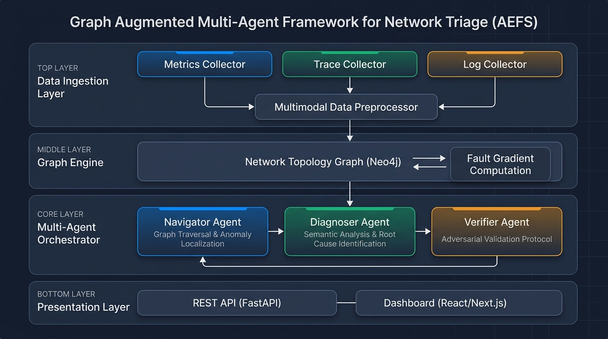

# GRAPHTRIAGE — Graph Augmented Multi-Agent Framework for Automated Network Triage

> **Course:** Cloud System Architecture  
> **Academic Year:** 2025–2026

---

## 📌 Project Title

**GRAPHTRIAGE — A Graph Augmented Multi-Agent Framework for Automating Root Cause Analysis in Distributed Telecommunication and Microservice Networks**

---

## 👥 Team Members

| Name | Role | Primary Responsibilities |
|------|------|--------------------------|
| **Mohak Harsh** | Team Lead / Multi-Agent Architect | Multi-agent orchestration framework, LangGraph pipeline, agent coordination, adversarial validation protocol |
| **Sandarbh Gupta** | Graph & Backend Engineer | Network topology graph (Neo4j), fault gradient computation, FastAPI backend, data ingestion pipeline |
| **Aarnav Mishra** | Frontend & Evaluation Engineer | React/Next.js dashboard, visualization components, benchmarking suite, dataset curation |

---

## 🔍 Problem Statement

Root Cause Analysis (RCA) in distributed telecommunication and microservice systems is a critical yet challenging task. Modern networks generate vast amounts of observability data — metrics, traces, and logs — that human Site Reliability Engineering (SRE) teams must manually correlate to identify failures. This process is:

- **Time-intensive:** Manual triage across multiple data sources delays resolution.
- **Error-prone:** Fragmented signals lead to missed correlations.
- **Non-scalable:** Growing network complexity outpaces human analytical capacity.

While recent AIOps solutions leverage LLMs to automate RCA, they suffer from **hallucinations** — generating plausible but incorrect diagnoses due to a lack of structural grounding. There is a critical need for a framework that combines the deterministic reasoning of graph-based topology analysis with the semantic understanding of LLMs, while incorporating safeguards against hallucinated outputs.

---

## 🎯 Objectives

1. **Design a graph-augmented multi-agent architecture** that separates topological search from semantic analysis to prevent hallucinations.
2. **Implement a Navigator Agent** that leverages computed fault gradients to efficiently traverse the network topology graph and localize anomalies.
3. **Develop a Diagnoser Agent** capable of performing thorough semantic analysis on multimodal observability data (metrics, traces, logs) to identify potential root causes.
4. **Build a Verifier Agent** that employs an adversarial validation protocol to rigorously validate diagnoses before finalizing them.
5. **Create a real-time dashboard** for monitoring agent activity, visualizing the network graph, and presenting RCA results.
6. **Benchmark the framework** against existing RCA solutions to demonstrate improvements in accuracy, latency, and hallucination reduction.

---

## 🏗️ Proposed Architecture / Framework



### Architecture Overview

The GRAPHTRIAGE framework is organized into **four layers**:

#### 1. Data Ingestion Layer
- **Metrics Collector:** Ingests time-series performance metrics (CPU, memory, latency, error rates) from Prometheus/OpenTelemetry.
- **Trace Collector:** Captures distributed traces across microservices via Jaeger/Zipkin-compatible formats.
- **Log Collector:** Aggregates structured and unstructured logs from system components.
- **Multimodal Data Preprocessor:** Normalizes, timestamps, and correlates data from all three sources into a unified event stream.

#### 2. Graph Engine
- **Network Topology Graph (Neo4j):** Maintains a live representation of the network/microservice topology as a directed graph.
- **Fault Gradient Computation:** Computes anomaly scores and propagation gradients across graph edges to guide the Navigator Agent's traversal.

#### 3. Multi-Agent Orchestrator (Core)
- **Navigator Agent:** Traverses the topology graph using fault gradients to identify the most probable anomaly location. Acts as the structural/deterministic backbone.
- **Diagnoser Agent:** Receives the localized subgraph from the Navigator and performs deep semantic analysis using LLM reasoning on the associated metrics, traces, and logs.
- **Verifier Agent:** Applies adversarial validation — systematically challenging the Diagnoser's hypothesis with counter-evidence and alternative explanations before confirming or rejecting the diagnosis.

#### 4. Presentation Layer
- **REST API (FastAPI):** Exposes endpoints for triggering RCA, querying results, and streaming agent activity.
- **Dashboard (React/Next.js):** Real-time visualization of the network graph, agent traversal paths, diagnosis results, and confidence scores.

### Agent Interaction Flow

```
[Data Ingestion] → [Graph Engine] → [Navigator Agent] → [Diagnoser Agent] → [Verifier Agent]
                                          ↑                                        |
                                          └────────── Feedback Loop ───────────────┘
```

If the Verifier rejects a diagnosis, the feedback loop re-engages the Navigator with updated constraints, ensuring convergence toward the correct root cause.

---

## 🛠️ Technology Stack

| Layer | Technology | Purpose |
|-------|-----------|--------|
| **Multi-Agent Framework** | Python, LangGraph / CrewAI | Agent orchestration, state management, tool integration |
| **LLM Backend** | OpenAI GPT-4 / Google Gemini | Semantic reasoning for Diagnoser and Verifier agents |
| **Graph Database** | Neo4j | Network topology storage, Cypher queries, graph traversal |
| **Graph Processing** | NetworkX | Fault gradient computation, graph algorithms |
| **Backend API** | FastAPI | REST API for RCA triggers, results, and agent status |
| **Frontend** | React / Next.js | Dashboard, graph visualization, real-time monitoring |
| **Graph Visualization** | D3.js / Cytoscape.js | Interactive network topology rendering |
| **Containerization** | Docker, Docker Compose | Service isolation, reproducible deployments |
| **Orchestration** | Kubernetes (optional) | Scalable deployment for production environments |
| **Data Simulation** | Python (custom generators) | Synthetic network topology and fault injection |
| **Monitoring** | Prometheus, Grafana | Metrics collection and observability for the framework itself |
| **Version Control** | Git, GitHub | Source code management, collaboration |

---

## 📊 Dataset Details

Since real-world telecom RCA datasets are proprietary and scarce, we adopt a **hybrid approach**:

### Primary: Synthetic Data Generation
- Custom Python-based network topology generator producing realistic microservice architectures (50–500 nodes).
- Fault injection engine simulating cascading failures, latency spikes, resource exhaustion, and misconfigurations.
- Multimodal data generation: correlated metrics, traces, and logs for each simulated incident.

### Secondary: Public Benchmarks
| Dataset | Description | Use Case |
|---------|------------|----------|
| **AIOps Challenge 2020/2022** | Multi-source anomaly detection data from real microservice systems | Benchmarking anomaly localization |
| **Train-Ticket Benchmark** | Open-source microservice benchmark application with fault injection support | End-to-end RCA evaluation |
| **Sock Shop (Weaveworks)** | Microservices demo application for cloud-native environments | Topology-based testing |
| **Google Cluster Traces** | Large-scale cluster workload traces | Metrics-based anomaly detection |

---

## 📁 Repository Structure

```
GRAPHTRIAGE-SIM/
├── README.md                          # Project overview (this file)
├── WORK_DISTRIBUTION.md               # Detailed task allocation
├── frontend/                          # React/Next.js dashboard
│   └── README.md
├── backend/                           # FastAPI REST API
│   └── README.md
├── ai_models/                         # Multi-agent framework core
│   ├── agents/                        # Navigator, Diagnoser, Verifier agents
│   │   └── README.md
│   ├── graph_engine/                  # Neo4j integration & fault gradients
│   │   └── README.md
│   ├── llm/                           # LLM provider wrappers & prompts
│   │   └── README.md
│   └── README.md
├── data/                              # Datasets and data generation
│   ├── synthetic/                     # Generated topology & fault data
│   │   └── README.md
│   ├── benchmarks/                    # Public benchmark datasets
│   │   └── README.md
│   └── README.md
├── database/                          # Database schemas & configurations
│   └── README.md
├── docs/                              # Documentation
│   ├── architecture/                  # Architecture diagrams
│   │   └── README.md
│   ├── literature_survey/             # Literature survey document
│   │   └── README.md
│   └── research_gap/                  # Research gap analysis
│       └── README.md
├── results/                           # Evaluation results & analysis
│   └── README.md
├── presentation/                      # Project presentations & demos
│   └── README.md
├── tests/                             # Test suites
│   └── README.md
├── docker/                            # Docker & deployment configs
│   └── README.md
└── .gitignore                         # Git ignore rules
```

---

## 🚀 Getting Started

> ⚠️ **Note:** This repository is currently in the **planning and design phase**. Implementation will follow the approved architecture.

### Prerequisites
- Python 3.10+
- Node.js 18+
- Neo4j 5.x
- Docker & Docker Compose

### Setup (Coming Soon)
```bash
# Clone the repository
git clone https://github.com/Mohak325/GRAPHTRIAGE-SIM.git
cd GRAPHTRIAGE-SIM

# Backend setup
cd backend && pip install -r requirements.txt

# Frontend setup  
cd frontend && npm install

# Start all services
docker-compose up
```

---

## 📄 License

This project is developed for academic purposes as part of the **Cloud System Architecture** course.

---

## 📬 Contact

For queries regarding this project, please reach out to any of the team members listed above.
