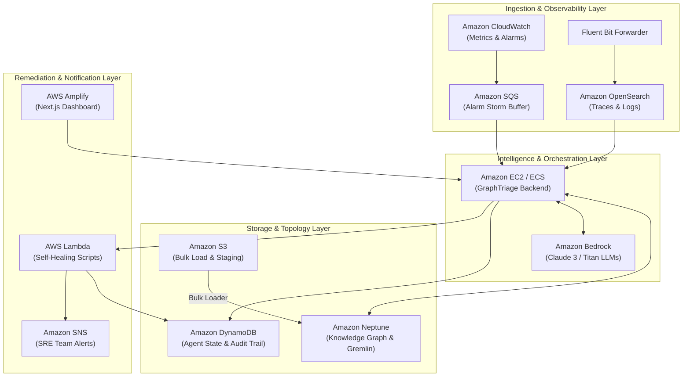

# GraphTriage — Complete AWS Services Setup & Architecture Guide

> **Course:** Cloud System Architecture / Cloud Architecture Design (Slot B1+TB1)  
> **Team:** Sandarbh Gupta (24BIT0506), Mohak Harsh (24BIT0558), Aarnav Mishra (24BIT0534)  
> **Project:** GRAPHTRIAGE — A Graph-Augmented Multi-Agent Architecture for Automated Root Cause Localization

---

## Architecture Overview

GraphTriage leverages 12 integrated AWS cloud services to eliminate microservice data silos, automate human Site Reliability Engineering (SRE) workflows, and execute closed-loop self-healing remediations.



---

## 1. Amazon Neptune (Knowledge Graph & Fault Traversal)

* **Purpose:** Stores the 12-microservice topology, call dependencies, container mappings, and anomalies as an explicit Property Graph.
* **Protocol:** Apache TinkerPop Gremlin over WebSocket (`wss://<cluster-endpoint>:8182/gremlin`).
* **Implementation Files:**
  - Traversal Schema: [`database/neptune/gremlin_schema.py`](file:///c:/Users/sanda/OneDrive/Desktop/cloud/GraphTriage/database/neptune/gremlin_schema.py)
  - Cypher-to-Gremlin Migrator: [`database/neptune/cypher_to_gremlin_migrator.py`](file:///c:/Users/sanda/OneDrive/Desktop/cloud/GraphTriage/database/neptune/cypher_to_gremlin_migrator.py)
  - Groovy Seed Script: [`database/neptune/seed_gremlin.groovy`](file:///c:/Users/sanda/OneDrive/Desktop/cloud/GraphTriage/database/neptune/seed_gremlin.groovy)
  - Async Python Client: [`database/neptune/neptune_client.py`](file:///c:/Users/sanda/OneDrive/Desktop/cloud/GraphTriage/database/neptune/neptune_client.py)
* **Setup Instructions:**
  1. Deploy using CloudFormation template: [`docker/aws/cloudformation-master.yaml`](file:///c:/Users/sanda/OneDrive/Desktop/cloud/GraphTriage/docker/aws/cloudformation-master.yaml).
  2. Neptune resides inside your VPC. Connect using an SSH Bastion tunnel:
     ```powershell
     ssh -i key.pem -N -L 8182:<neptune-endpoint>:8182 ec2-user@<bastion-public-ip>
     ```
  3. Configure backend in [backend/config.py](file:///c:/Users/sanda/OneDrive/Desktop/cloud/GraphTriage/backend/config.py):
     ```env
     GRAPH_BACKEND=neptune
     NEPTUNE_ENDPOINT=wss://localhost:8182/gremlin
     ```

---

## 2. Amazon S3 (Staging & Bulk Loading)

* **Purpose:** Staging bucket for Neptune Bulk Loader CSVs and historical telemetry archives.
* **Bucket Structure:**
  - `s3://graphtriage-data-<account>-<region>/seed/neptune_vertices.csv`
  - `s3://graphtriage-data-<account>-<region>/seed/neptune_edges.csv`
* **Loading Command (from within VPC):**
  ```bash
  curl -X POST \
    -H 'Content-Type: application/json' \
    https://<NEPTUNE_ENDPOINT>:8182/loader \
    -d '{
      "source" : "s3://graphtriage-data-<account>-<region>/seed/",
      "format" : "csv",
      "iamRoleArn" : "<NEPTUNE_S3_ROLE_ARN>",
      "region" : "us-east-1",
      "failOnError" : "FALSE"
    }'
  ```

---

## 3. Amazon OpenSearch Service (Logs & Traces)

* **Purpose:** Ingests, indexes, and normalizes unstructured microservice logs and distributed traces.
* **Implementation Files:**
  - Index Templates & Mappings: [`docker/aws/opensearch_index_templates.json`](file:///c:/Users/sanda/OneDrive/Desktop/cloud/GraphTriage/docker/aws/opensearch_index_templates.json)
  - Fluent Bit Log Forwarder: [`docker/aws/fluent-bit.conf`](file:///c:/Users/sanda/OneDrive/Desktop/cloud/GraphTriage/docker/aws/fluent-bit.conf)
* **Indices Created:**
  - `graphtriage-metrics-*`: Numeric time-series KPIs.
  - `graphtriage-traces-*`: Spans with `trace_id`, `caller`, `callee`, `latency_ms`.
  - `graphtriage-logs-*`: Structured logs with error classifications and stack traces.

---

## 4. Amazon CloudWatch (Metrics & Log Groups)

* **Purpose:** High-resolution scraping of host/container health (CPU, memory, disk, network) and log streams.
* **Implementation File:** [`docker/aws/cloudwatch-agent-config.json`](file:///c:/Users/sanda/OneDrive/Desktop/cloud/GraphTriage/docker/aws/cloudwatch-agent-config.json)
* **Log Groups:**
  - `/aws/graphtriage/microservices` (14 days retention)
  - `/aws/graphtriage/remediation` (30 days retention)
  - `/aws/graphtriage/api-gateway/access`

---

## 5. Amazon Bedrock (Foundation LLMs for Agents)

* **Purpose:** Powers the semantic causal reasoning of the **Diagnoser Agent** and counterfactual challenges of the **Verifier Agent**.
* **Supported Models:** Anthropic Claude 3 Sonnet (`anthropic.claude-3-sonnet-20240229-v1:0`), Claude 3 Haiku, Amazon Titan Text Express.
* **Implementation File:** [`ai_models/llm/bedrock_provider.py`](file:///c:/Users/sanda/OneDrive/Desktop/cloud/GraphTriage/ai_models/llm/bedrock_provider.py)
* **Usage:**
  ```python
  from ai_models.llm.bedrock_provider import BedrockLLMProvider

  provider = BedrockLLMProvider(model_id="anthropic.claude-3-sonnet-20240229-v1:0")
  diagnosis = provider.diagnose_failure(service_id="srv-payment-service", subgraph_nodes=[...], metrics=[...], logs=[...])
  print(diagnosis["root_cause"], diagnosis["confidence"])
  ```

---

## 6. AWS Lambda (Closed-Loop Automated Remediation)

* **Purpose:** Automatically executes self-healing remediation scripts when an incident root cause is verified (e.g., connection pool scaling, pod restarts, circuit breaking).
* **Implementation File:** [`docker/aws/remediation_lambda.py`](file:///c:/Users/sanda/OneDrive/Desktop/cloud/GraphTriage/docker/aws/remediation_lambda.py)
* **Actions Handled:**
  - `scale_db_pool_and_recycle`: Expands pool capacity from 50 to 200 connections.
  - `trip_circuit_breaker_and_flush_cache`: Halts cascading timeouts in Order Service.
  - `restart_container_replica`: Recycles hung worker threads.

---

## 7. Amazon DynamoDB (Fast Session & Audit Store)

* **Purpose:** Stores fast-access agent memory, active sessions, and historical remediation audit trails.
* **Tables:**
  - `GraphTriage-Remediations`: Primary Key `incident_id` (String), Sort Key `timestamp` (Number).
  - `GraphTriage-AgentSessions`: Primary Key `session_id` (String).

---

## 8. Amazon SQS (Alarm Storm Buffering & DLQ)

* **Purpose:** Buffers high-volume telemetry and alarm floods during cascading outages so backend agents are not overwhelmed.
* **Queues Created:**
  - `graphtriage-prod-alarm-storm-queue`: Primary buffer with 60s visibility timeout.
  - `graphtriage-prod-alarms-dlq`: Dead Letter Queue retaining failed messages for 14 days.

---

## 9. Amazon SNS (SRE Notification Topic)

* **Purpose:** Sends immediate alerts and self-healing action summaries to human SRE teams via email, SMS, or Slack webhooks.
* **Topic:** `GraphTriage-SRE-Alerts` (configured in CloudFormation and triggered by `remediation_lambda.py`).

---

## 10. Amazon EC2 (Orchestration & Bastion Host)

* **Purpose:** Hosts the FastAPI backend orchestrator and serves as a secure SSH bastion host for accessing private VPC services (Neptune).
* **Specifications:** Amazon Linux 2023 or Ubuntu 22.04 LTS (`t3.medium` or `t4g.medium`).

---

## 11. AWS IAM (Least-Privilege Security Roles)

* **Roles Created:**
  - `NeptuneS3Role`: Grants Neptune read access to S3 staging bucket.
  - `LambdaRemediationRole`: Grants Lambda permissions to log to DynamoDB and publish to SNS.
  - `BedrockAgentPolicy`: Grants `bedrock:InvokeModel` permissions.

---

## 12. AWS Amplify (Dashboard Hosting)

* **Purpose:** Continuous deployment and hosting for the Next.js Cytoscape dashboard.
* **Implementation Script:** [`frontend/deploy.sh`](file:///c:/Users/sanda/OneDrive/Desktop/cloud/GraphTriage/frontend/deploy.sh)
* **Deployment URL Pattern:** `https://develop.<app-id>.amplifyapp.com`

---

## One-Click Deployment Guide

To deploy the entire architecture at once:

1. Open AWS Console > **CloudFormation** in `us-east-1`.
2. Click **Create Stack** > **With new resources (standard)**.
3. Upload the template: [`docker/aws/cloudformation-master.yaml`](file:///c:/Users/sanda/OneDrive/Desktop/cloud/GraphTriage/docker/aws/cloudformation-master.yaml).
4. Review the parameters and acknowledge IAM resource creation.
5. Click **Submit**!
